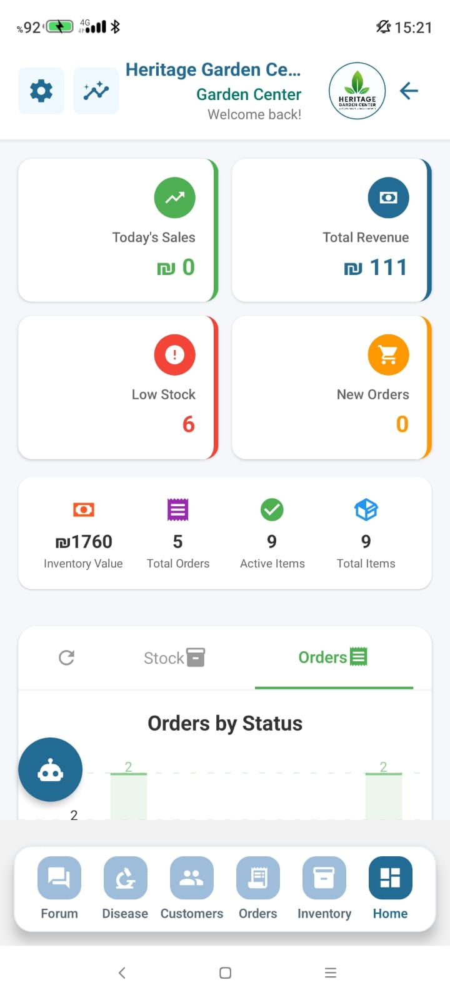
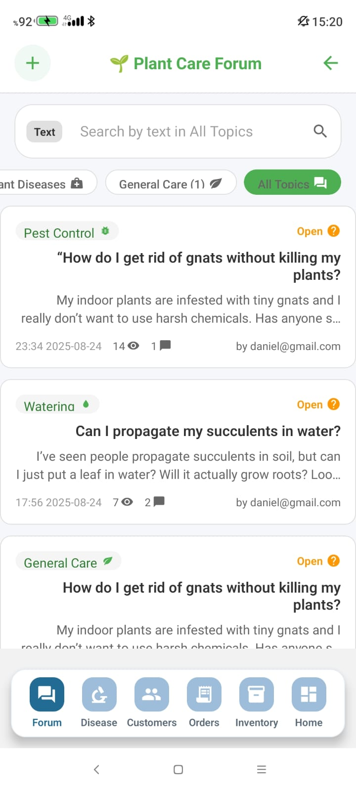
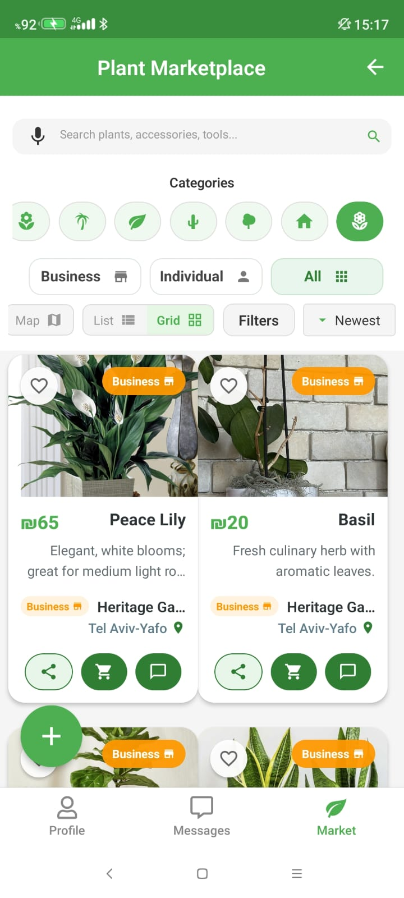
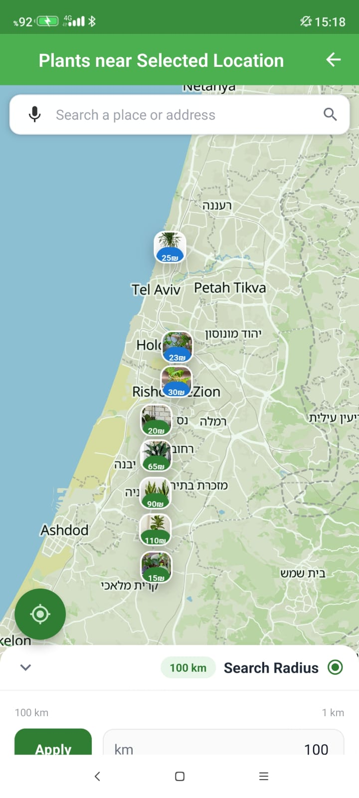
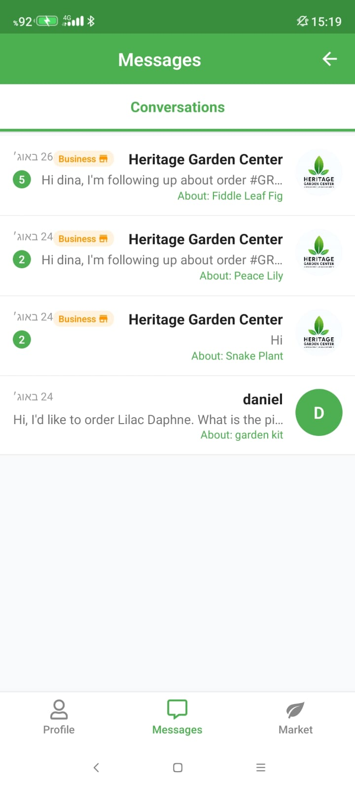
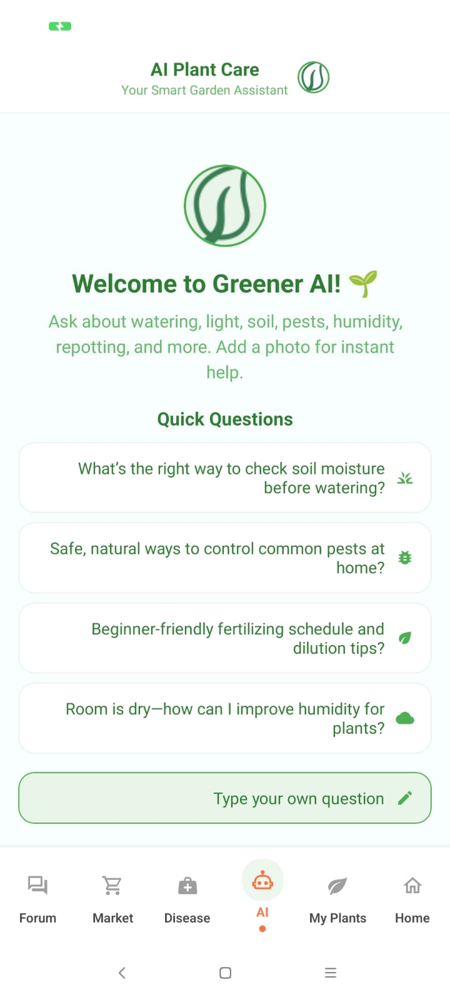
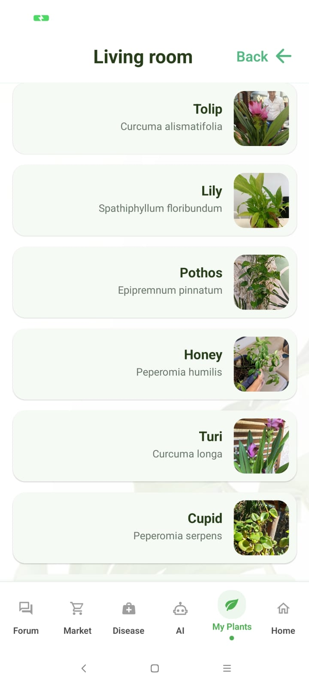
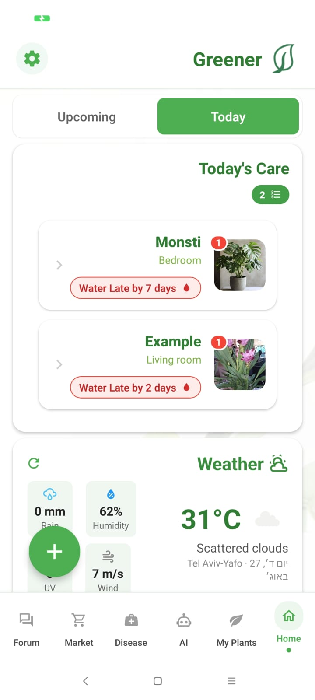

# 🌱 Greener

<div align="center">
  
</div>

<div align="center">
  <h3>🌿 Greener — The All-in-One Platform for Plant Lovers & Green Businesses</h3>
  <p><strong>Helping individuals and eco-businesses grow, connect, and thrive with intelligent care and green solutions.</strong></p>
</div>

---

## 📌 Overview

**Greener** is a modern, cloud-native platform for sustainable living. It connects plant enthusiasts and green businesses through a feature-rich ecosystem that includes a marketplace, plant care assistant, inventory management, real-time chat, and business analytics.

* ✅ Android App.
* ✅ Azure-based scalable backend with Cosmos DB
* ✅ Smart plant care: weather-aware advice powered by Azure Maps & OpenWeather
* ✅ Dual user roles: consumers (personal plant care, wishlists) & businesses (inventory, analytics, reviews)
* ✅ Notifications: push alerts via Firebase Cloud Messaging (FCM) 
* ✅ Real-time, AI-powered, and secure

---

## 📱 Preview
Here are some screenshots of the app in action:
<div align="center">
  <table>
    <tr>
      <td align="center"><br><b>Business Home Screen</b></td>
      <td align="center"><br><b>Plant Care Forum</b></td>
      <td align="center"><br><b>Orders</b></td>
    </tr>
    <tr>
      <td align="center"><br><b>Marketplace Home Screen</b></td>
      <td align="center"><br><b>Marketplace Map</b></td>
      <td align="center"><br><b>Real-time Chat</b></td>
    </tr>
    <tr>
      <td align="center"><br><b>AI Chatbot</b></td>
      <td align="center"><br><b>My Plants</b></td>
      <td align="center"><br><b>Consumer Home Screen</b></td>
    </tr>
  </table>
</div>
---

## 💡 Why Greener?

* 🌿 **Sustainable Marketplace** — Discover eco-products, plants, and services from trusted sellers
* 👥 **Dual Personas** — Tailored experiences for plant lovers and green businesses
* 🤖 **AI Plant Assistant** — Weather-aware care tips, reminders, and push notifications
* 📈 **Business Insights** — Dashboards, inventory tools, KPIs, and customer intelligence  
* 💬 **Community & Messaging** — Forums, reviews, and SignalR-powered real-time chat

---

## 🚀 Getting Started

## ⚙️ Prerequisites

- **Node.js** >= 16.0.0
- **npm** >= 8.0.0
- **Python** >= 3.9.0
- **Azure CLI** >= 2.0.0
- **Expo CLI** (`npm install -g expo-cli`)
- **.NET SDK** (for Azure Functions extensions, if using C#)
- **Android Studio** or **Xcode** (for mobile emulation, optional)
- **Firebase CLI** (for push notification setup, optional)

## 🧪 Local Development

```bash
# Clone the repo
git clone https://github.com/dinasim/greener.git
cd greener

# Install frontend dependencies
npm install

# Start the React app
npx expo run:android
```

## 🧰 System Architecture
```
frontend/
│
├── App.js                     # Entry point, loads navigation and initializes global providers
├── app.json / eas.json         # Expo & EAS configuration
├── assets/                     # Static images, icons, and other media
│
├── /screens/                   # Feature-specific screens for users
│   • PlantCareScreen, ProfileScreen, MarketplaceScreen
│   • BusinessDashboardScreen, InventoryScreen
│   → Handles UI, connects to context & services for data
│
├── /components/                # Reusable UI components
│   • PlantCard, BusinessCard, KPIWidget, ChatBubble
│   → Ensures design consistency across screens
│
├── /services/                  # API client layer
│   • marketplaceApi.js, businessApi.js, plantApi.js, chatApi.js
│   → Handles HTTP requests to Azure Functions backend
│   → Provides standardized error handling and caching
│
├── /navigation/                # App routing and navigation
│   • Tab navigation for consumer vs. business flows
│
├── /Business/                  # Business-specific flows
│   • Dashboard, inventory management, sales insights
│   • Uses context + services to fetch/store business data
│
├── /marketplace/               # Marketplace-specific flows
│   • Browse products/plants, wishlist, reviews
│   • Integrates with marketplaceApi.js
│
├── /notifications/             # Push notification logic
│   • FCM token registration
│
├── pushRegistrationSnippet.js  # Helper for registering push tokens
├── /utils/                     # Helper utilities (formatting, constants, validation)
├── /hooks/                     # Custom React hooks (e.g., useAuth, useNotifications)
├── /public/                    # Web build assets
└── config & build files        # (babel.config.js, tsconfig.json, eslint.config.mjs, etc.)


backend/
│
├── user & auth
│   • registeruser, loginuser, business-login, business-login-check
│   • user-profile, saveUser, update_device_token, registerDeviceToken, registerWebPush
│   → Handles registration, authentication (hash+salt), and device/web push token management
│
├── marketplace & products
│   • marketplace-products, marketplace-products-specific, marketplace-products-wish
│   • products-create, update-product, delete-product, user-listings, nearby-products
│   • reviews-submit, reviews-get, reviews-delete
│   → Marketplace listings, wishlists, product CRUD, and reviews
│
├── business
│   • business-inventory-*, business-orders-*, business-dashboard, business-analytics, business-reports
│   • business-profile, business-customers, business-weather-forecast, business-watering-checklist
│   • business_register_notification, business-notification-settings
│   → Full business suite: inventory, orders, analytics, weather-linked watering, notifications
│
├── plants & care
│   • addUserPlant, getalluserplants, getuserplantbyid, getUserPlantsByLocation
│   • plantDetailsInJson, identifyPlantPhoto, generate_plant_barcode, uploadUserPlantPhoto
│   • ai-plant-care-chat, diseaseCheck, plant-care-forum, forum-replies
│   • daily_watering_update, watering_checklist, optimize_watering_route
│   • getWeatherAdvice, plantSupportReminders, send_watering_notifications
│   → Core plant care logic: plant registration, photo recognition, forums, AI-based chat,
│     watering reminders/optimization, disease checks, and weather-aware advice
│
├── chat & community
│   • create-chat, get-messages, read-message, send-message, conversations
│   • typing-indicator, chat-history, chatMessageNotify, signalr-negotiate
│   • plant-care-forum, forum-replies
│   → Real-time chat with SignalR, message history, read receipts, typing indicators, and plant forums
│
├── notifications
│   • registerDeviceToken, registerWebPush, listUserTokens
│   • get_pending_notifications, mark_notification_read
│   • send_consumer_notifications, testSendPush, test_notification
│   • consumer-notification-settings, notification_settings
│   • firebase_helpers.py
│   → Push notification pipeline: registration, storage, delivery via FCM, and user settings
│
├── location & maps
│   • geocode, reverse-geocode, maps-config, getcities, addcity
│   • get_nearby_businesses, get-all-businesses
│   → Location services: geocoding, city data, and nearby business discovery
│
├── shared utilities
│   • db_helpers.py, http_helpers.py, storage_helpers.py
│   • speechToText, speechToken
│   → Common helpers for Cosmos DB access, HTTP requests, blob storage, and speech APIs
│
├── monitoring & misc
│   • ping, markTaskDone
│   • host.json, local.settings.json, requirements.txt
│   → Health checks, task markers, and configuration


```
## 🏗️ Architecture Overview
- **Frontend:** A cross-platform application built with React Native and Expo, targeting Android and Web platforms. The codebase features a modular architecture organized by features (Marketplace, Chat) and personas (User, Business), with component-based design patterns and custom services for API interaction and state management.
- **Backend:** A serverless backend powered by Azure Functions (Python) for scalable compute. Data persistence is handled through Azure Cosmos DB, while real-time messaging capabilities are provided by Azure SignalR Service. Push notifications are delivered via Firebase Cloud Messaging (FCM). The system includes a robust custom authentication layer with role-based access control (RBAC).

## 🧰 Tech Stack
<div align="center">
  
  
  
  
  
  
  
  
</div>
---
---

## ✨ Key Features

### 👤 Consumer Experience

* 🌱 Smart Plant Assistant (weather-aware tips, reminders, and AI chat)
* 💧 Watering reminders & care schedules
* 🛒 Personalized marketplace & wishlists
* 📚 My Plants dashboard
* 🧑‍🧳 Community forums, reviews & real-time chat

### 💼 Business Experience

* 📊 Business dashboard & analytics
* 🛋️ Inventory and order management
* 👨‍💼 Customer profile insights
* 🌐 Online storefront with branding
* 💧 Weather-linked watering forecasts & checklists

### ⚖️ Admin & Security

* 🔐 Role-based access (consumer, business, admin)
* 🛡️ Secure session handling
* 📃 Encrypted Cosmos DB storage
* 🔒  Custom authentication with hash+salt

---

## 📜 License

© 2025 Greener 

---

## 🙏 Acknowledgments

Developed as part of a university project at Tel Aviv University.

* Nir Levi – Course Instructor
* Omer Avramovich – Teaching Assistant

---

<div align="center">
  <strong>⭐ Star this repository if you believe in sustainable commerce!</strong><br/><br/>
  <a href="https://github.com/dinasim/greener">
    
